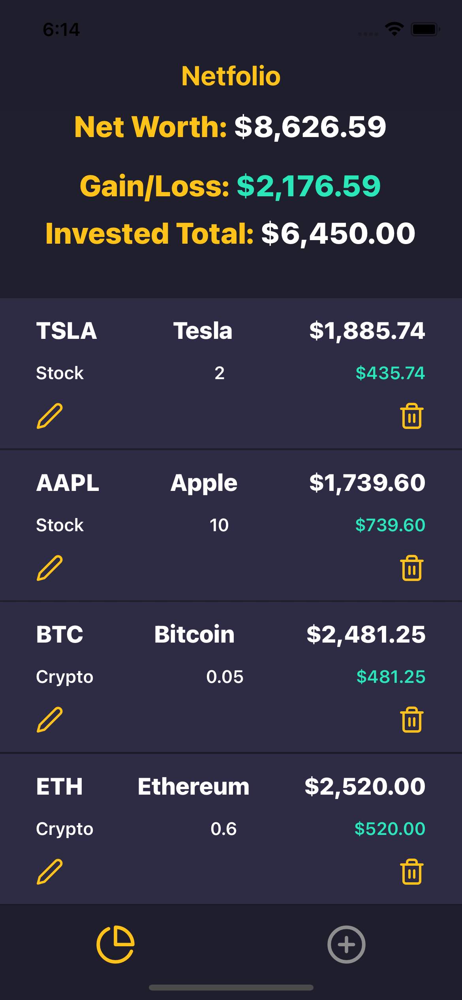

# Netfolio

## Project Links

- [Deployed Backend](https://netfolio-backend.herokuapp.com/assets)
- [Front End](https://github.com/mpenajoia/Netfolio-Front)
- [Back End](https://github.com/mpenajoia/Netfolio-Back)


## Project Description

If you're like me and have multiple accounts with different brokerages for your stock investments and different exchanges/wallets for cryptocurrency assets then you know how cumbersome it can be to have to look in multiple applications for an idea of your entire net worth. Netfolio attempts to aid in organizing one's personal investments in one easy to read application. 


## Frame Grab


## User Story

User will be able to input their stock or crypto asset name/symbol with the amount of shares/tokens they hold plus the amount in USD they invested in said asset. The App will display their holding's value as it related to today's price. User will have a bird's eye view of entire portfolio health. 

## Technologies

React Native - front end
Heroku/Express/Mongo for the back end

## API(s)

Coingecko.com provides a public API for crypto pricing. 
 - [Coingecko](https://www.coingecko.com/en/api/documentation)

Finnhub.io seems to provide both stock and crypto price, further investigation necessary. 
 - [Finnhub](https://finnhub.io/docs/api/quote)


## Wireframes

- [Wireframe](https://res.cloudinary.com/ds2rdojzc/image/upload/v1639689826/CryptoDreamsApp/Screen_Shot_2021-12-16_at_12.03.09_PM_xx7f4v.png)
- [React Architecture](https://res.cloudinary.com/ds2rdojzc/image/upload/a_270/v1639689844/CryptoDreamsApp/Netfolio_Arch_kxk12c.jpg)


### MVP:

##### V1

- User can input an item with a quantity and value
- User will also input the current market value of item to update pricing
- Calculation will be made to determine Gains or Losses

##### V2

- Back end will be implemented for full CRUD so that user can actually save these assets, edit/update their quantities, or delete their holdings

##### V3

- Instead of user inputting the current market value every time, the live price will be pulled from an API (either one for both stocks and crypto or an API for each)
- Calculations for gains and losses will be made against the fetched data

##### V4 

- User Authentication will be implemented for user to sign in and save their information


#### PostMVP 
- Adding charts like pie charts and line graphs, etc.
- Add an 'other' category for items other than stocks or crypto that the user can fully adjust


## Components

| Component | Description | 
| :---: | :---: |  
| App | initial GET request and render Tab Navigator| 
| Header | renders Logo and remains across all pages | 
| Main | content wrapper under header for all other components | 
| Add Asset | form for POST request |
| Edit Asset | modal component with form for PUT request |
| Assets | component that will list all the assets |
| Asset | component for each asset with DELETE request |


## MVP

| Component | Priority | Estimated Time | Time Invested |
| --- | :---: |  :---: | :---: | 
| Making components and linking/routing them correctly | H | 6hrs|  6hrs | 
| Main/Assets/Asset | H | 3hrs|  4hrs | 
| Taking user input value to run math logic and return results | H | 5hrs|  3hrs | 
| Aesthetics/CSS | H | 7hrs|  6hrs | 
| Responsiveness | H | 4hrs|  8hrs | 
| Correct use of React Hooks | H | 4hrs|  3hrs | 
| Pulling Api data | H | 2hrs|  2hrs | 
| Populating Api data correctly | H | 5hrs|  1hrs | 
| Deployment | H | 5hrs|  4hrs | 
| Total | H | 41hrs| 37hrs |

## Post MVP

| Component | Priority | Estimated Time | Time Invested |
| --- | :---: |  :---: | :---: | 
| Pie charts and other charts | H | 6hrs|  -hrs | 
| User Log in | M | 10hrs|  -hrs |
| Final tweaks | M | 4hrs | 1hrs |  
| Total | H | 20hrs| 1hrs |


## Inspiration
Layout and color palette inspirations
 - [Investments App by Viktor Kogdov](https://www.behance.net/gallery/111508221/Investments-app?tracking_source=search_projects_recommended%7Cstock%20app)
 - [Trading Platform by Gleb Kuznetsov](https://dribbble.com/shots/15258817-Trading-platform-graphic) 
 - [EasyInvest mobile app by Layo](https://dribbble.com/shots/16910736-EasyInvest-mobile-app) 
 - [Bitcoin UI Kit by Maxim Grekov](https://www.behance.net/gallery/62362875/Stock-exchangeBitcoin-UI-Kit-for-Cryptocurrency-Vol-01?tracking_source=search_projects_recommended%7Cstock%20app) 

## Code Snippet
Just a simple check to confirm the data has been fetched and saved in a state before a map function is triggered

```js
if (props.assets){
        assetsMap = props.assets.map((item, index) => {
            netWorthArr.push(item.qty * item.current)
            netInvestedArr.push(item.invested)
            return(
                <Asset  api={props.api} gainLoss={gainLoss} key={index} getAssets={props.getAssets} setAssets={props.setAssets} assets={props.assets} index={index} item={item}/>
                )
            })
    }else{
        assetsMap = <Text>Map empty</Text>
    }
```